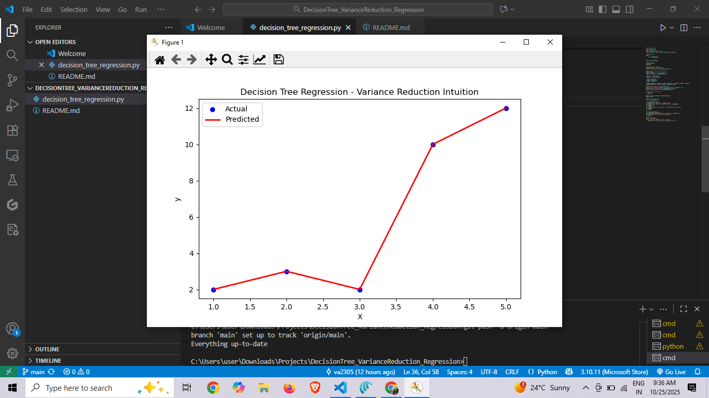

# Decision Tree Regression - Variance Reduction

## 📌 Project Overview
This project demonstrates the working of **Decision Tree Regression** with a focus on **variance reduction**, which is the core concept behind regression trees. The model predicts continuous target values by splitting data into regions where variance is minimized.

---

## 🧠 Key Concepts

### 1. Decision Tree Regression
- A Decision Tree Regressor predicts a **continuous target variable**.
- It recursively splits the feature space into regions based on a threshold that **reduces variance** the most.
- Leaf nodes contain the **mean value** of the target variable in that region.

### 2. Variance Reduction
- **Variance** measures the spread of target values.
- **Parent node variance**: variance of the entire dataset before any split.
- **Child node variance**: variance of subsets after splitting.
- **Weighted child variance**: average of child variances weighted by the number of samples in each subset.
- **Variance reduction** = Parent variance − Weighted child variance
- The split that maximizes variance reduction is chosen by the tree.

---

## 📊 Dataset
A small example dataset is used for clarity:

| X | y  |
|---|----|
| 1 | 2  |
| 2 | 3  |
| 3 | 2  |
| 4 | 10 |
| 5 | 12 |

- `X` → Independent feature  
- `y` → Target value

---

## 📝 Code Overview

1. **Import Libraries**: `pandas`, `numpy`, `matplotlib`, `sklearn.tree`.
2. **Create Dataset** and display it.
3. **Calculate Parent Variance**.
4. **Manual Split** to demonstrate variance reduction calculation.
5. **Train Decision Tree Regressor** using Scikit-Learn.
6. **Predict Values** and visualize results.
7. **Plot Tree Structure** to understand splits.
8. **Compare Actual vs Predicted** values.

---

## 📈 Output Visualization

- **Scatter Plot:** Shows actual vs predicted values.  
- **Decision Tree Plot:** Shows how the tree splits data to minimize variance.


---

### 📊 Model Output Visualization

Below is the output of the Decision Tree Regression model after training:



## 🏃 How to Run

1. Clone the repository:
```bash
git clone https://github.com/va2305/DecisionTree_Regression_VarianceReduction.git
